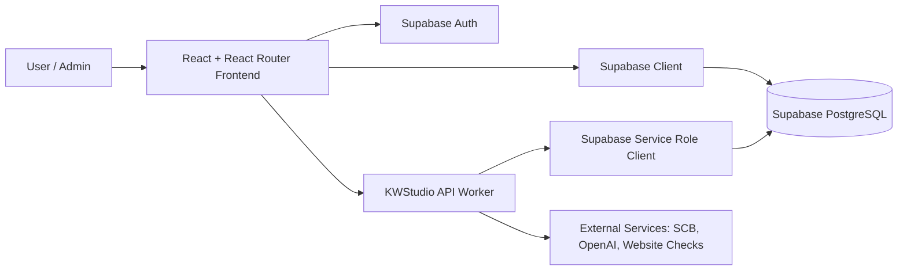
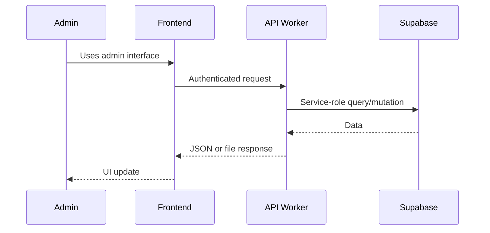
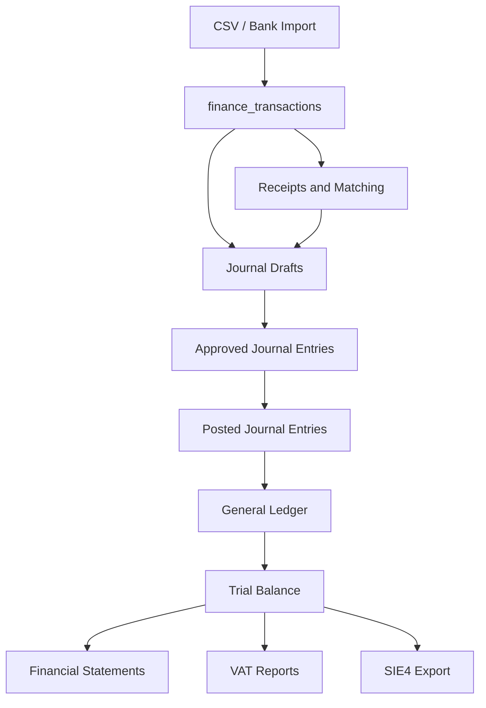
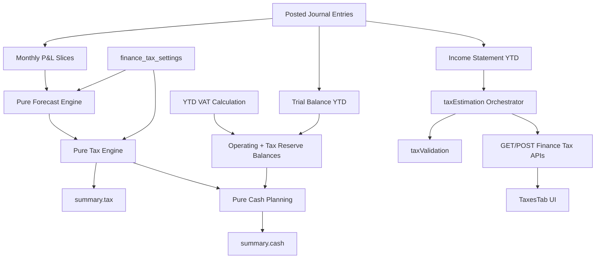
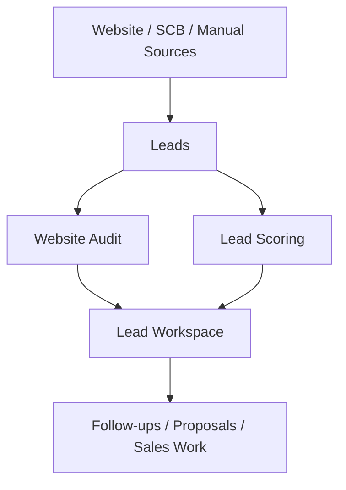
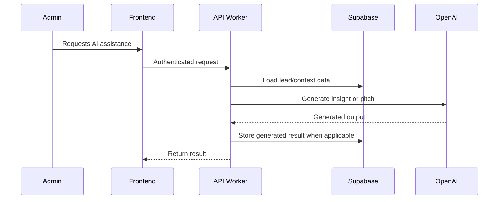

# Architecture

## Overall Architecture

KWStudio consists of three main layers:

- React frontend application.
- TypeScript API Worker.
- Supabase PostgreSQL database and authentication.

## React Application

The React application is the user-facing and admin-facing frontend.

Key areas:

- Public marketing routes in `app/routes`.
- Admin views in `app/routes/admin`.
- Shared UI components in `app/components`.
- Frontend API wrappers in `app/services`.
- Static/fallback domain data in `app/data`.

The admin UI uses an `AdminShell` pattern with reusable panels, tables, tabs, metrics, and status badges.

## API Worker

The API Worker is a sibling TypeScript/Express project. It owns backend business logic and privileged Supabase access.

Core files:

- `src/index.ts` - Express app setup, CORS, JSON parsing, route registration.
- `src/routes/*` - Thin route modules.
- `src/services/*` - Business logic and domain rules.
- `src/middleware/*` - Authentication and authorization middleware.
- `src/lib/supabase.ts` - Service-role Supabase client.

Route modules should remain thin. Services should own validation, calculations, and persistence rules.

## Supabase

Supabase provides:

- PostgreSQL database.
- Auth sessions used by the frontend.
- RLS-protected tables.
- Service-role backend access through the API Worker.

Schema changes must be made with SQL migrations. Existing migrations define lead platform tables, AI insight tables, finance import tables, receipt tables, and development RLS policies.

## Authentication Approach

Frontend:

- Uses Supabase Auth sessions.
- Sends bearer tokens to the API Worker.

Backend:

- Uses `requireSupabaseAuth` middleware for authenticated routes.
- Uses service-role Supabase client for privileged database operations.

TODO:

- Confirm final production admin role model and RLS policy strategy.

## Services

Services contain domain logic:

- Finance import parsing and transaction persistence.
- Receipt upload, matching, extraction, and recalculation.
- Journal posting workflow.
- Ledger and trial balance calculations.
- Financial statements.
- VAT period generation.
- SIE4 export generation.
- Lead scoring and sales pitch generation.
- Swedish Tax Estimation (Enskild Firma) — estimation only, not statutory filing.

## Routes

Routes should:

- Authenticate requests.
- Validate basic request shape.
- Call a service.
- Return typed JSON or file responses.
- Avoid embedding business rules.

## Data Flow

## Finance Flow

Finance must flow from source data into immutable accounting records.

Rules:

- Posted journal entries and journal lines are the accounting source of truth.
- Raw transactions are not used directly for reports.
- Posted entries are immutable.
- SIE export includes only posted entries with journal lines.

## Tax Estimation Flow

Tax Estimation is a read-only planning layer for Enskild Firma. It never replaces Skatteverket or writes to the ledger.

### Source-of-truth rules

- Only **posted** journal entries feed income statement, trial balance, and monthly profit slices.
- Draft, approved-but-unposted, and raw `finance_transactions` are ignored.
- Tax rates and accounts come from `finance_tax_settings` (migration `013_finance_tax_settings.sql`).
- Blocking validation errors return HTTP **422**; warnings never block the response.

### Tax Estimation vs Cash Planning

| Area | `summary.tax` | `summary.cash` |
|------|---------------|----------------|
| Purpose | Estimated liability (egenavgifter + income tax) | Liquidity planning |
| Key inputs | Taxable profit, rates, adjustments | Bank balances, VAT YTD, estimated total tax |
| Must not include | Bank balances, VAT payable/refundable | Tax rates, taxable profit fields |

`summary.cash.estimated_tax_remaining` derives from `summary.tax.estimated_total_tax` minus the configured tax reserve account balance. Clients display both sections independently.

### Forecast modes

| Mode | Behavior |
|------|----------|
| `ytd_only` | Annual profit = YTD posted profit |
| `ytd_linear` | Linear annualization: `(YTD / months elapsed) × 12` |
| `manual` | User-supplied annual profit override |
| `scenario` | `ytd_linear` base + additive scenario deltas (what-if only) |

Forecast confidence (`low` / `medium` / `high`) is scored from posted history, mode, missing months, and manual/scenario overrides.

### Scenario calculator (stateless)

`POST /finance/tax-estimation/scenario` accepts base query params plus `scenario_deltas[]`:

- `future_invoice` — positive income delta
- `future_expense` — expense delta (optional `vat_rate` for gross-to-net)
- `one_time_adjustment` — signed P&L adjustment

The endpoint loads ledger context once, computes **base** (query forecast mode) and **scenario** (`ytd_linear` + deltas), and returns diffs for `summary.tax` and `summary.cash`. Nothing is persisted; no journal entries are created.

### Settings requirements

Minimum configuration before estimation runs:

- `municipality_code` and `municipal_tax_rate`
- `tax_reserve_account` present in chart of accounts
- At least one posted journal entry in the tax year YTD
- Balanced trial balance for the YTD period

Optional: `egenavgifter_rate`, church/state tax flags, `operating_bank_account`, `forecast_default_mode`, manual tax adjustments.

### API endpoints

| Method | Path | Purpose |
|--------|------|---------|
| GET | `/finance/tax-estimation` | Full estimate |
| GET | `/finance/tax-estimation/breakdown` | Breakdown only |
| GET | `/finance/tax-estimation/forecast` | Monthly projection |
| GET | `/finance/tax-estimation/validation` | Pre-flight validation |
| POST | `/finance/tax-estimation/scenario` | Stateless what-if |
| GET/PATCH | `/finance/settings/tax` | Read/update settings |

### Regression coverage

`npm run test:tax` runs unit/regression suites for:

- `taxEngine.regression.ts`
- `forecastEngine.regression.ts`
- `taxValidation.regression.ts`
- `cashPlanning.regression.ts`
- `taxEstimation.regression.ts`
- `taxEstimationMatrix.regression.ts` — full 18-scenario matrix

### Future work (not implemented)

- Municipality rate lookup helper
- Skatteverket / NE export integration
- Aktiebolag tax estimation
- Live municipal tax rate updates from external sources

## Finance UI (Frontend)

Finance admin views live primarily in `app/routes/admin/_PageViews.tsx` (tab shell) with shared primitives:

| Layer | Location |
|-------|----------|
| Formatting | `app/lib/financeFormat.ts` — `formatKr`, `formatPercent`, `formatFinanceAmount`, dates |
| Feedback states | `app/components/admin/finance/FinanceFeedback.tsx` — loading, error, setup, validation lists |
| Journal preview | `app/components/admin/finance/JournalPreviewTable.tsx` |
| Status | `app/components/admin/StatusBadge.tsx` — single registry for finance lifecycle states |
| Layout | Inline `FinancePanel`, `FinanceKpiGrid`, `FilterBar`, `EmptyState`, `AdminTable` |

Live API-backed tabs: Import (CSV), Transactions, Receipts, Owner Expenses, VAT, Taxes, Reports (SIE). Demo/static tabs remain for Bookkeeping, Invoices, Expenses, Assets, Settings until wired.

Stabilization rules (Priority 10.8):

- Swedish locale formatting via shared helpers only.
- Errors use `FinanceErrorBanner` with optional retry — no raw backend stack traces.
- Loading uses `FinanceLoadingMessage`; empty data uses `EmptyState`.
- HTTP 422 setup responses use `FinanceSetupBanner` (Tax Estimation).
- Status badges pass backend snake_case keys directly where possible.

## CRM Flow

## AI Generation Flow

Important:

- AI is appropriate for lead, sales, copy, and audit assistance.
- AI is not appropriate for accounting source-of-truth generation or statutory exports.

