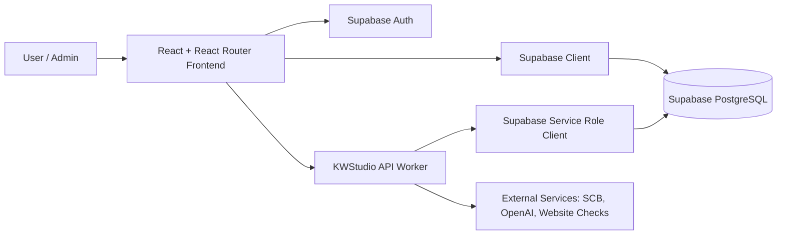
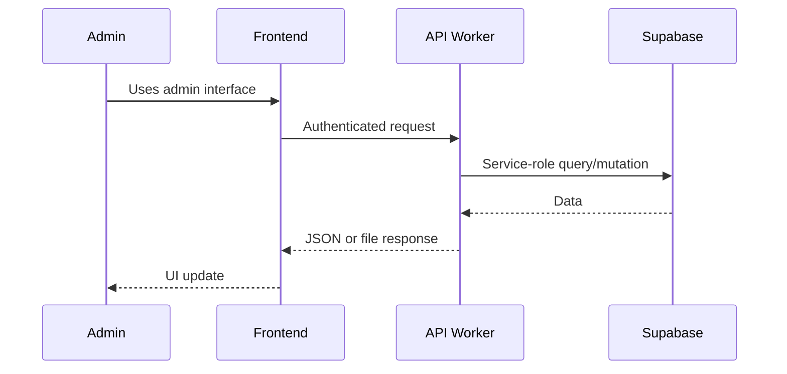
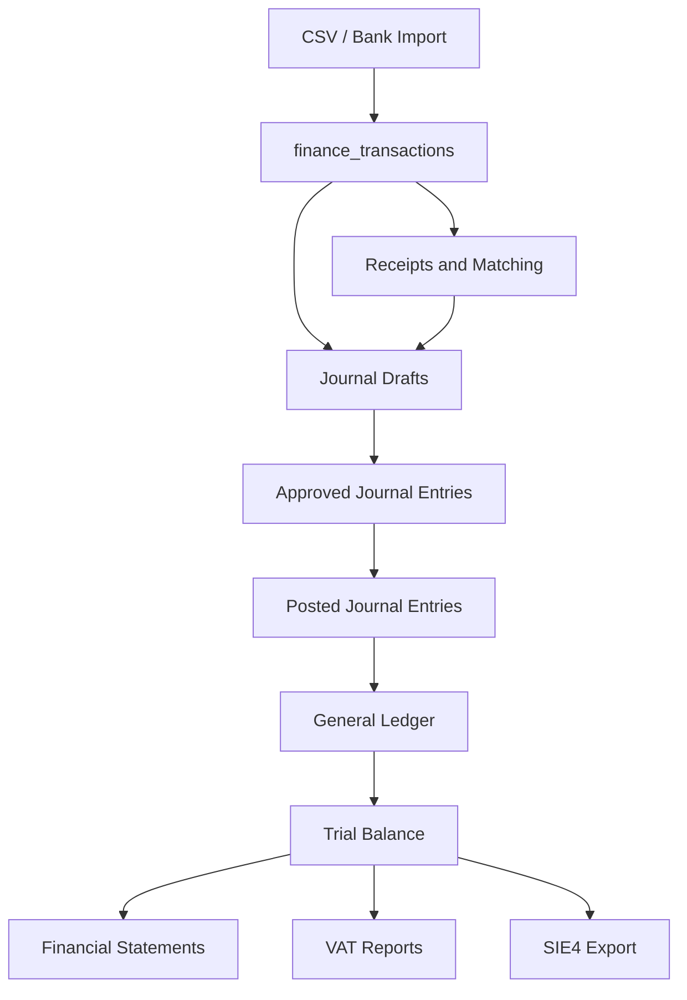
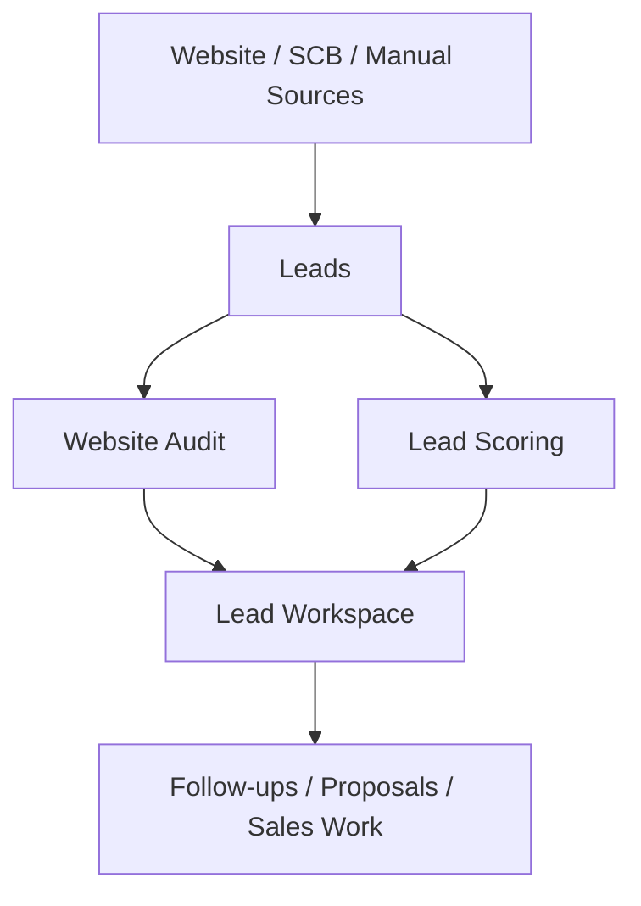
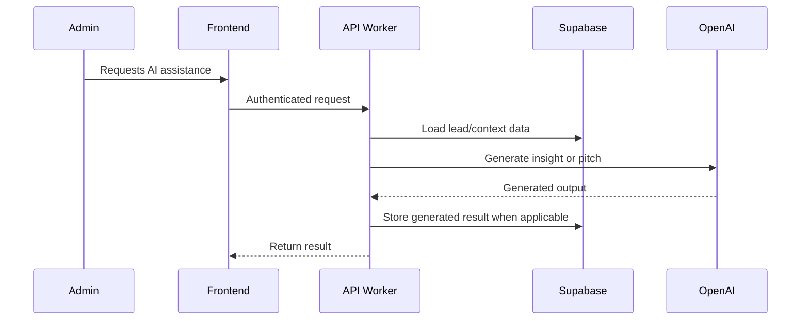

# Architecture

## Overall Architecture

KWStudio consists of three main layers:

- React frontend application.
- TypeScript API Worker.
- Supabase PostgreSQL database and authentication.

## React Application

The React application is the user-facing and admin-facing frontend.

Key areas:

- Public marketing routes in `app/routes`.
- Admin views in `app/routes/admin`.
- Shared UI components in `app/components`.
- Frontend API wrappers in `app/services`.
- Static/fallback domain data in `app/data`.

The admin UI uses an `AdminShell` pattern with reusable panels, tables, tabs, metrics, and status badges.

## API Worker

The API Worker is a sibling TypeScript/Express project. It owns backend business logic and privileged Supabase access.

Core files:

- `src/index.ts` - Express app setup, CORS, JSON parsing, route registration.
- `src/routes/*` - Thin route modules.
- `src/services/*` - Business logic and domain rules.
- `src/middleware/*` - Authentication and authorization middleware.
- `src/lib/supabase.ts` - Service-role Supabase client.

Route modules should remain thin. Services should own validation, calculations, and persistence rules.

## Supabase

Supabase provides:

- PostgreSQL database.
- Auth sessions used by the frontend.
- RLS-protected tables.
- Service-role backend access through the API Worker.

Schema changes must be made with SQL migrations. Existing migrations define lead platform tables, AI insight tables, finance import tables, receipt tables, and development RLS policies.

## Authentication Approach

Frontend:

- Uses Supabase Auth sessions.
- Sends bearer tokens to the API Worker.

Backend:

- Uses `requireSupabaseAuth` middleware for authenticated routes.
- Uses service-role Supabase client for privileged database operations.

TODO:

- Confirm final production admin role model and RLS policy strategy.

## Services

Services contain domain logic:

- Finance import parsing and transaction persistence.
- Receipt upload, matching, extraction, and recalculation.
- Journal posting workflow.
- Ledger and trial balance calculations.
- Financial statements.
- VAT period generation.
- SIE4 export generation.
- Lead scoring and sales pitch generation.

## Routes

Routes should:

- Authenticate requests.
- Validate basic request shape.
- Call a service.
- Return typed JSON or file responses.
- Avoid embedding business rules.

## Data Flow

## Finance Flow

Finance must flow from source data into immutable accounting records.

Rules:

- Posted journal entries and journal lines are the accounting source of truth.
- Raw transactions are not used directly for reports.
- Posted entries are immutable.
- SIE export includes only posted entries with journal lines.

## CRM Flow

## AI Generation Flow

Important:

- AI is appropriate for lead, sales, copy, and audit assistance.
- AI is not appropriate for accounting source-of-truth generation or statutory exports.

